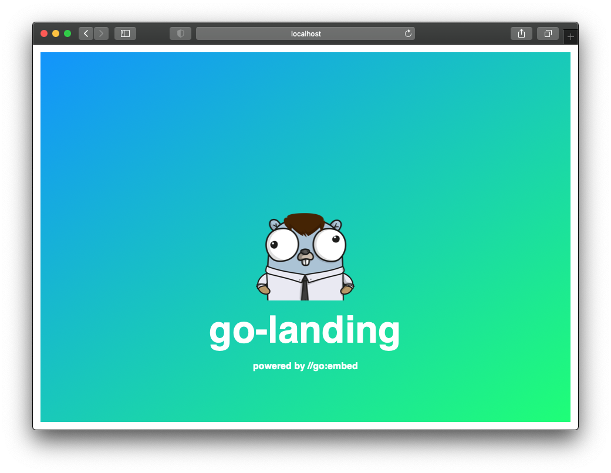

# go-landing

A minimalistic, templated landing page web server written in go.



[](https://hub.docker.com/r/kristofferahl/go-landing/)

## Build

```bash
go build .
```

## Run

```bash
go run .
```

## Configuration

| Environment variable | Description | Default |
| --- | --- | --- |
| LANDING_TEMPLATE | The path to the html template | templates/index.html.tmpl |
| LANDING_TITLE | The title displayed on the landing page | go-landing |
| LANDING_DESCRIPTION | The description displayed on the landing page | powered by //go:embed |
| LANDING_LINKS | Markdown links to display on the landing page, separated by ; |  |
| LANDING_SERVER_NAME | The name of the server, as shown in the X-Server header | go-landing |
| LANDING_CATCHALL_ENABLED | Catch all paths and display landing page | false |
| LANDING_NOTFOUND_MESSAGE | Not found error message | 404 Not found |
| LANDING_PING_ENABLED | Enable ping endpoint | true |
| LANDING_PING_MESSAGE | Ping endpoint response message | OK |
| LANDING_HOSTNAMES | When set, if the hostname does not match, a not found response will be given |  |

```bash
export LANDING_TEMPLATE='templates/index.html.tmpl'
export LANDING_TITLE='go-landing'
export LANDING_DESCRIPTION='powered by //go:embed'
export LANDING_LINKS='[Github](https://github.com/kristofferahl/go-landing);[Docker Hub](https://hub.docker.com/r/kristofferahl/go-landing)'
export LANDING_PING_MESSAGE='HTTP OK - go-landing'
```

## Running in docker

```bash
docker build -t kristofferahl/go-landing:v1.1.0 --platform linux/amd64 .
docker run --rm -p 9000:9000 \
  -e LANDING_TITLE='go-landing' \
  kristofferahl/go-landing:v1.1.0
```
